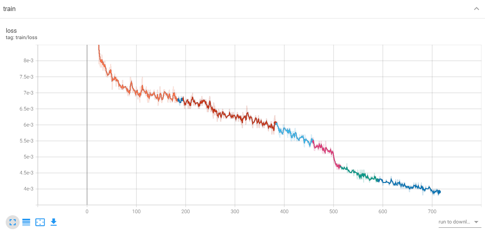
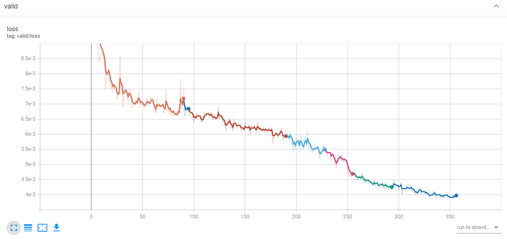
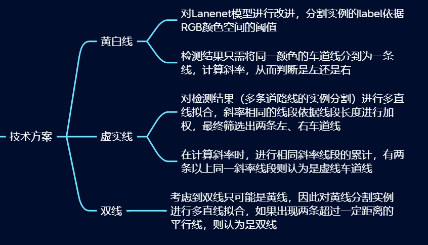

# LaneNet道路线检测

## 1.训练模型
### 关于数据集
按照原论文数据集结构以及数据标注方式，准备数据集

步骤包括`labelme人工标注`  利用`to_grey.py`进行图片格式的转换  准备`train.txt`和`val.txt`

tips:

二值化图像（gt_image_binary）将所有道路线标为1 

分割实例（gt_image_instance）按照黄线和白线进行道路线区分

数据集准备好后，更改`n_labels`，直接训练即可

```python
epochs = 1000 
bs = 16 
lr = 0.0005 
lr_decay = 0.5 
lr_decay_epoch = 250
```

训练过程中的数据可以在`log.txt`中查看

训练出来的模型在`checkpoints`文件夹中

### 关于训练输出
模型训练中最重要的输出为`seg_logits`
```python
net_output = model(image_data)
seg_logits = net_output["seg_logits"]
total_loss = Loss(seg_logits, instance_label.long())
```
原因1：用于计算Loss，如上方截取的训练代码

原因2：经过转换，可以得到黄色像素点为1，白色为2，在结果可视化和后处理（道路线分类）中，可以用于区分黄线和白线

而`instance_seg_logits`经过我的实验，无法得到预期的实例分割，在数据进入dataloader前，没有对其进行单个实例的分割

与此同时，`binary_seg_pred`仅能得到道路线与背景的二分类


### 一些确实训练过的证明



在训练时，可以使用tensorboard监测，而我这里是手动加载训练日志。

耗时两天多......

## 2.检测、后处理及可视化

重新写了一个检测的程序，在里面加入了黄白线检测、虚实线检测、道路线拟合。

因此，可以直接使用`detect.py`来进行图片检测，一些设置如下

```txt
python detect.py --help
usage: detect.py [-h] [--weights WEIGHTS [WEIGHTS ...]] [--source SOURCE]
                 [--device DEVICE] [--view-img] [--project PROJECT]

optional arguments:
  -h, --help            show this help message and exit
  --weights WEIGHTS [WEIGHTS ...]
                        model path(s)
  --source SOURCE       the image dir
  --device DEVICE       cuda device, i.e. 0 or 0,1,2,3 or cpu
  --view-img            show results
  --project PROJECT     save results to project/name
```

具体的方法为



其中，多条直线拟合用到的方法是`cv2.HoughLinesP`

## 3.未来构想

对模型进行虚实线的分类，而非仅仅黄白线

在代码中加入早停，防止无效训练

